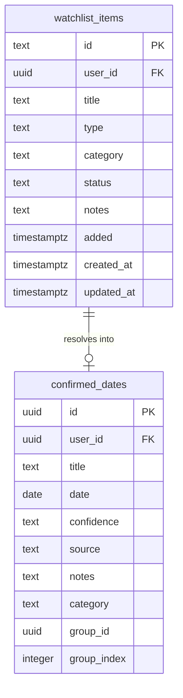

# Sync Watchlist Items to Supabase via CLI

## Overview

Decouple the desktop (and future iOS) app from reading local watchlist markdown files by syncing watchlist state to a Supabase `watchlist_items` table via new CLI commands. Files on disk remain the source of truth for the agent workflow; the database is the read source for client applications.

## Problem Statement / Motivation

The desktop app currently reads watchlist items by parsing `.md` files from `agent/watchlist/` using `fs.readdirSync` + `gray-matter`. This requires:
- The user to have the repo cloned locally
- A configured `repoPath` in `~/.goldfish/desktop-config.json`
- Direct filesystem access from the Electron main process

This creates a tight coupling between the desktop app and the local filesystem, making it impossible for the iOS app to show watchlist items and fragile when the repo path changes or files are modified outside the expected flow.

Meanwhile, `confirmed_dates` already lives in Supabase and is read by both desktop and iOS apps. The watchlist should follow the same pattern.

## Proposed Solution

### Architecture Decision: Agent writes file, CLI syncs to database

The agent continues to write/manage `.md` files (source of truth). After each file operation, the agent calls a CLI command to sync that state to Supabase. This avoids the complexity of passing multi-line fields (`confirmed_when`, `notes`) via CLI flags.

**Flow: Add watchlist item**
1. Agent writes `agent/watchlist/<id>.md` (existing behavior)
2. Agent calls `goldfish watchlist sync --file agent/watchlist/<id>.md`
3. CLI reads the `.md` file, parses frontmatter, upserts into `watchlist_items`

**Flow: Resolve watchlist item**
1. Agent finds a confirmed date via web search (existing behavior)
2. Agent calls `goldfish watchlist resolve --id <id> --date <date> --confidence <level> --source <url>`
3. CLI inserts into `confirmed_dates`, updates `watchlist_items.status` to `resolved` with resolution metadata
4. Agent moves file to `agent/resolved/confirmed/` (existing behavior)

**Flow: Desktop/iOS reads watchlist**
1. App queries `watchlist_items` where `status = 'active'` from Supabase
2. No filesystem access needed

### Why agent-writes-file + CLI-syncs

- Avoids CLI needing to serialize multi-line YAML (`confirmed_when`, `notes`, `search_queries`)
- Agent already has `Write`/`Edit` tools; file creation is natural
- `sync --file` is a simple "read file, upsert row" operation
- Keeps files as source of truth — database is a projection

## Technical Considerations

### Database Schema

New table: `watchlist_items`

```sql
CREATE TABLE watchlist_items (
  id TEXT NOT NULL,
  user_id UUID NOT NULL REFERENCES auth.users(id),
  title TEXT NOT NULL,
  type TEXT NOT NULL DEFAULT 'one-time',
  category TEXT,
  status TEXT NOT NULL DEFAULT 'active',
  notes TEXT,
  added TIMESTAMPTZ NOT NULL DEFAULT now(),
  created_at TIMESTAMPTZ NOT NULL DEFAULT now(),
  updated_at TIMESTAMPTZ NOT NULL DEFAULT now(),
  PRIMARY KEY (user_id, id)
);

-- RLS: users can only see their own items (matches confirmed_dates pattern)
ALTER TABLE watchlist_items ENABLE ROW LEVEL SECURITY;

CREATE POLICY "Users can view own watchlist items"
  ON watchlist_items FOR SELECT
  USING (auth.uid() = user_id);

CREATE POLICY "Users can insert own watchlist items"
  ON watchlist_items FOR INSERT
  WITH CHECK (auth.uid() = user_id);

CREATE POLICY "Users can update own watchlist items"
  ON watchlist_items FOR UPDATE
  USING (auth.uid() = user_id)
  WITH CHECK (auth.uid() = user_id);

CREATE POLICY "Users can delete own watchlist items"
  ON watchlist_items FOR DELETE
  USING (auth.uid() = user_id);

-- Index for common queries
CREATE INDEX idx_watchlist_items_user_status ON watchlist_items(user_id, status);
```



### CLI Commands

New command group: `goldfish watchlist`

**`goldfish watchlist sync --file <path>`**
- Reads a `.md` file, parses YAML frontmatter with `gray-matter`
- Upserts into `watchlist_items` (insert on conflict update)
- Outputs: `Synced: <title> (<id>)`

**`goldfish watchlist sync --dir <path>`**
- Scans all `.md` files in the given directory
- For each file, parses YAML frontmatter and upserts into `watchlist_items`
- Useful as a batch sync or drift safety net
- Outputs: `Synced: <title> (<id>)` for each file, then a summary count

**`goldfish watchlist resolve --id <id> --date <date> --confidence <level> [--source <url>] [--notes <text>] [--category <text>]`**
- Performs two ordered writes:
  1. First: inserts into `confirmed_dates` (the higher-value write — this is what the user cares about)
  2. Second: updates `watchlist_items` row — sets `status = 'resolved'`, `resolved_on = now()`
- If the `confirmed_dates` insert succeeds but the `watchlist_items` update fails, logs a warning but exits 0 (the date is saved; the agent can re-sync the watchlist file to repair)
- Uses `ON CONFLICT` for idempotent confirmed_dates insert (safe to re-run)
- Reuses the insertion logic from `goldfish date add` (shared function, not duplicated)
- Outputs: `Resolved: <title> → <date>`

**`goldfish watchlist remove --id <id>`**
- Sets `status = 'removed'` in database (soft delete)
- Outputs: `Removed: <title>`

### Input Validation

The `sync --file` command must validate frontmatter before upserting to Supabase, following the pattern established in `cli/src/commands/date.ts`:

- **Always set `user_id` from the authenticated session**, never from the file
- **Destructure only allowlisted fields**: `id`, `title`, `type`, `category`, `notes`, `added`
- **Required fields**: `id` and `title` must be non-empty strings
- **Enum validation**: `type` must be one of `one-time`, `recurring-irregular`, `recurring-predictable`, `series`, `category-watch`
- **Wrap parsing in try/catch**: skip malformed files gracefully with a warning message
- **Status field**: set by the CLI based on context (e.g. `active` for sync, `resolved` for resolve), never from the file

### Key Files to Modify

| File | Change |
|------|--------|
| `cli/src/index.ts` | Register new `watchlist` command group |
| `cli/src/commands/watchlist.ts` | New file: `sync`, `resolve`, `remove` subcommands |
| `cli/package.json` | Add `gray-matter` dependency (pin >= 4.0.3 for security) |
| `desktop/src/main/index.ts:326-358` | Replace filesystem `watchlist:list` IPC handler with Supabase query |
| `desktop/src/main/index.ts:12` | Already has Supabase client — reuse for watchlist queries |
| `agent/.claude/commands/pls-watch.md` | Add `goldfish watchlist sync` call after file write |
| `agent/.claude/commands/pls-run.md` | Replace `goldfish date add` + file move with `goldfish watchlist resolve` + file move |
| `.claude/commands/pls-search.md` | Add `goldfish watchlist sync` call in watchlist fallback path |
| `agent/CLAUDE.md` | Update CLI reference section: replace `goldfish date add` docs with `goldfish watchlist sync`, `resolve`, and `remove` command references |

## System-Wide Impact

- **Interaction graph**: Agent writes file → calls CLI → CLI writes to Supabase. Desktop reads from Supabase on focus/refresh. No new callbacks or observers.
- **Error propagation**: If CLI sync fails, the file still exists (source of truth intact). Desktop shows stale data until next successful sync. Agent workflow is not blocked.
- **State lifecycle risks**: File and database can drift if sync fails silently. Mitigated by: (1) CLI exits non-zero on failure, agent sees the error; (2) a manual `goldfish watchlist sync --file` can repair any item; (3) `/pls-run` calls `goldfish watchlist sync --dir agent/watchlist/` as a final sweep to catch any missed syncs.
- **API surface parity**: Desktop and iOS both read from the same Supabase table. Agent reads from files, writes to both files and database via CLI.

## Acceptance Criteria

- [x] `watchlist_items` table created in Supabase with RLS policies
- [x] `goldfish watchlist sync --file <path>` reads a markdown file and upserts into database
- [x] `goldfish watchlist sync --dir <path>` scans directory and upserts all items
- [x] `goldfish watchlist resolve --id <id> --date <date> --confidence <level>` updates watchlist status and inserts confirmed date
- [x] `goldfish watchlist remove --id <id>` soft-deletes a watchlist item
- [x] Desktop `watchlist:list` IPC handler queries Supabase instead of filesystem
- [x] `/pls-watch` agent command calls `goldfish watchlist sync` after writing the file
- [x] `/pls-run` agent command calls `goldfish watchlist resolve` instead of `goldfish date add` for resolved items
- [x] `/pls-search` agent command calls `goldfish watchlist sync` when creating a watchlist fallback
- [x] `sync --file` validates frontmatter fields and sets `user_id` from session
- [ ] Existing 2 watchlist items are backfilled into database (one-time sync via `goldfish watchlist sync dir agent/watchlist/`)

## Success Metrics

- Desktop shows watchlist items without requiring `repoPath` filesystem access for watchlist
- Agent workflow continues to function identically (file-based source of truth preserved)
- iOS app can query `watchlist_items` table (even if UI is deferred)

## Dependencies & Risks

- **Supabase table creation** — Must be done manually in the Supabase dashboard (no local migrations in this project)
- **Session sharing** — CLI and desktop share `~/.goldfish/session.json`. If the session expires mid-agent-run, CLI commands will fail. Existing risk, not new.
- **Sync drift** — If the agent writes a file but the sync call fails, the database will be stale. Acceptable because files are the source of truth and any item can be re-synced with `goldfish watchlist sync --file`.
- **iOS deferred** — iOS watchlist UI is out of scope for this plan. The database table enables it, but the SwiftUI views are a follow-up.
- **gray-matter security** — Pin `gray-matter` >= 4.0.3. Older versions had YAML parsing vulnerabilities. Extract only allowlisted fields from parsed output (see Input Validation section).

## Implementation Order

1. Create `watchlist_items` table in Supabase (manual SQL)
2. Implement `goldfish watchlist sync --file` CLI command
3. Implement `goldfish watchlist resolve` CLI command
4. Implement `goldfish watchlist remove` CLI command
5. Backfill existing watchlist items: run `goldfish watchlist sync --file` on each existing `.md`
6. Update desktop `watchlist:list` IPC handler to query Supabase
7. Update `/pls-watch` to call sync after file write
8. Update `/pls-run` to call resolve instead of date add. `/pls-run` should also call `goldfish watchlist sync --dir agent/watchlist/` as a final sweep step to catch any drift between files and database.
9. Update `/pls-search` to call sync in watchlist fallback

## Sources & References

- Existing CLI pattern: `cli/src/commands/date.ts`
- Desktop watchlist IPC: `desktop/src/main/index.ts:326-358`
- Agent watchlist commands: `agent/.claude/commands/pls-watch.md`, `agent/.claude/commands/pls-run.md`
- CLI session/auth: `docs/solutions/integration-issues/supabase-cli-date-management.md`
- Desktop watchlist plan: `docs/plans/2026-03-06-feat-desktop-tabs-upcoming-and-watchlist-plan.md`
- Agent watchlist plan: `docs/plans/2026-03-06-feat-goldfish-agent-watchlist-system-plan.md`
